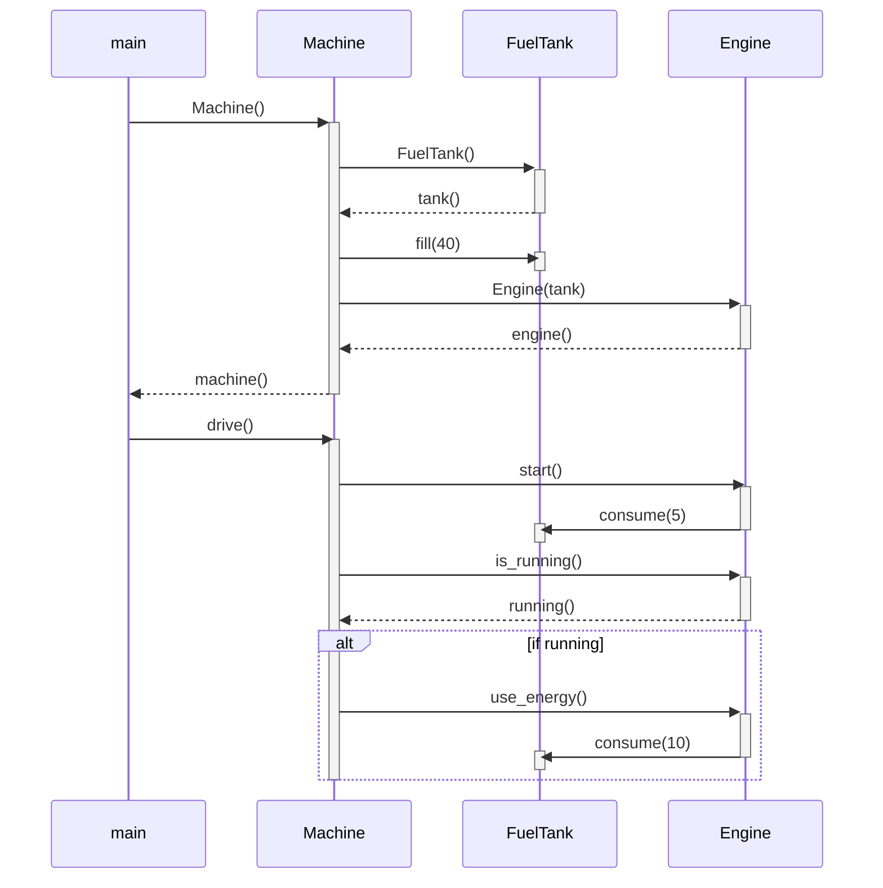

```mermaid
sequenceDiagram
    main ->>+ Machine:Machine()
    Machine ->>+ FuelTank:FuelTank() 
    FuelTank -->>- Machine:tank()
    Machine ->> FuelTank:fill(40)
    activate FuelTank
    deactivate FuelTank
    Machine ->>+ Engine:Engine(tank)
    Engine -->>- Machine:engine()    
    Machine -->>- main:machine()
    main ->> Machine:drive()
    activate Machine
    Machine ->> Engine:start()
    activate Engine
    Engine ->> FuelTank:consume(5)
    activate FuelTank
    deactivate FuelTank
    deactivate Engine
    Machine ->>+ Engine:is_running()
    Engine -->>- Machine:running()
    alt if running
        Machine ->>+ Engine:use_energy()
        Engine ->> FuelTank:consume(10)
        activate FuelTank
        deactivate FuelTank
        deactivate Engine
    end
    deactivate Machine
```
