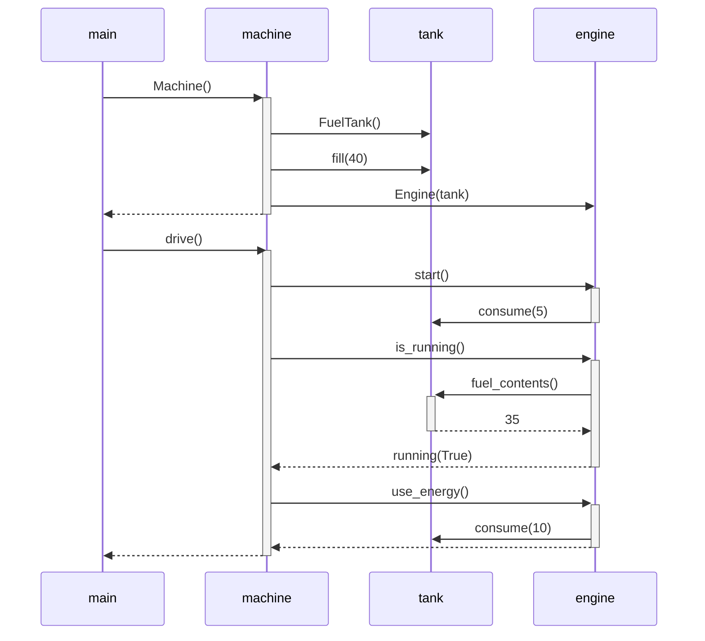

```mermaid
sequenceDiagram
    main ->>+ machine: Machine()
    machine ->> tank: FuelTank()
    machine ->> tank: fill(40)
    machine ->> engine: Engine(tank)
    machine -->>- main: 
    main ->> machine: drive()
    activate machine
    machine ->> engine: start()
    activate engine
    engine ->> tank: consume(5)
    deactivate engine
    machine ->>+ engine: is_running()
    engine ->>+ tank: fuel_contents()
    tank -->>- engine: 35
    engine -->>- machine: running(True)
    machine ->>+ engine: use_energy()
    engine ->> tank: consume(10)
    engine -->> machine:  
    deactivate engine
    machine -->> main: 
    deactivate machine
```
