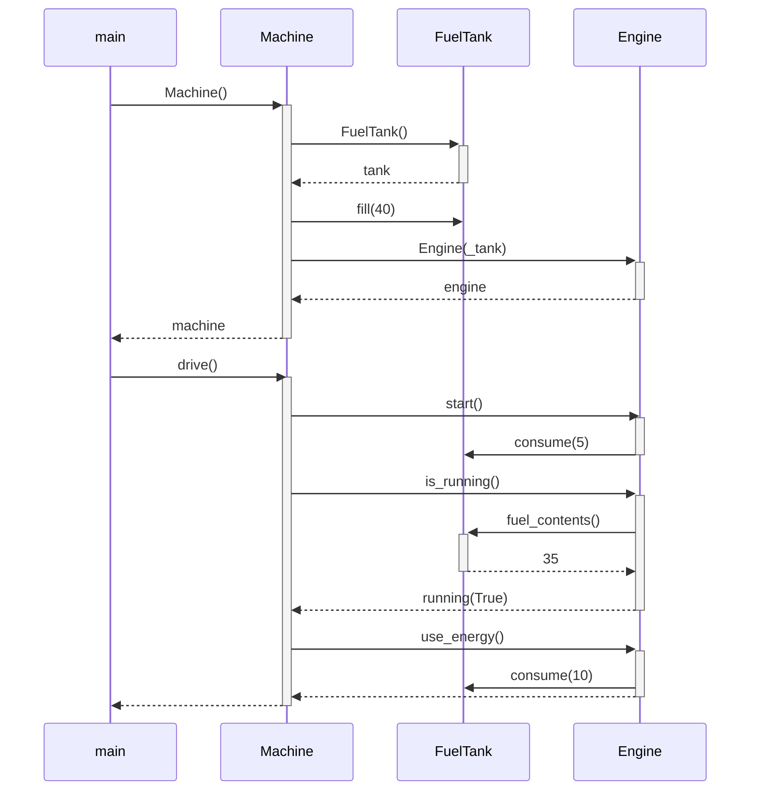

```mermaid
sequenceDiagram
    main ->>+ Machine: Machine()
    Machine ->>+ FuelTank: FuelTank() 
    FuelTank -->>- Machine: tank
    Machine ->> FuelTank: fill(40)
    Machine ->>+ Engine: Engine(_tank)
    Engine -->>- Machine: engine    
    Machine -->>- main: machine
    main ->> Machine: drive()
    activate Machine
    Machine ->> Engine: start()
    activate Engine
    Engine ->> FuelTank: consume(5)
    deactivate Engine
    Machine ->>+ Engine: is_running()
    Engine ->>+ FuelTank: fuel_contents()
    FuelTank -->>- Engine: 35
    Engine -->>- Machine: running(True)
    Machine ->>+ Engine:use_energy()
    Engine ->> FuelTank:consume(10)
    Engine -->> Machine:  
    deactivate Engine
    Machine -->> main: 
    deactivate Machine
```
