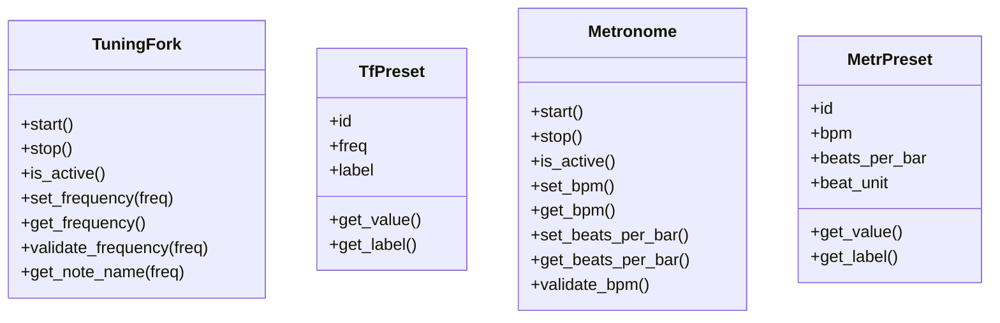
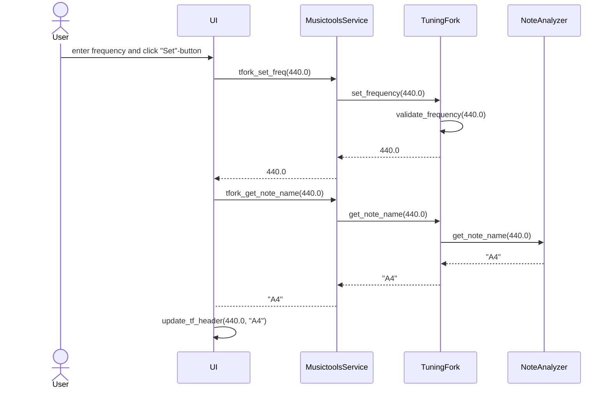
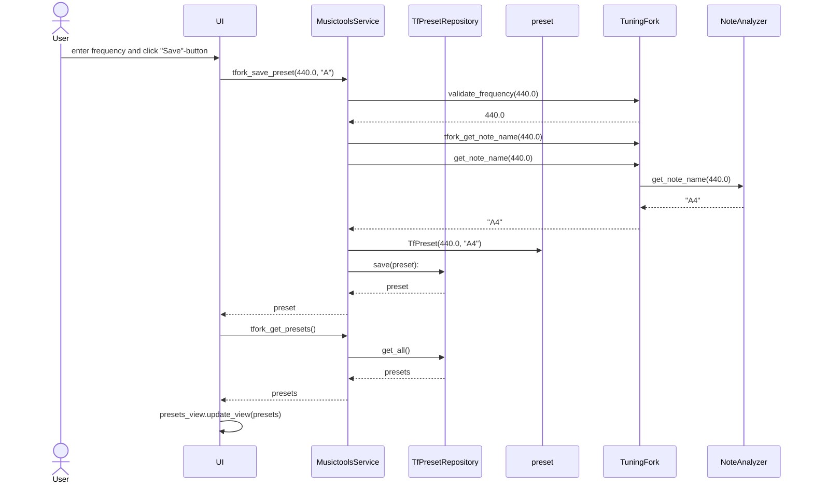

# Arkkitehtuurikuvaus

## Rakenne

Ohjelman rakenne noudattaa kolmitasoista kerrosarkkitehtuuria, jossa pakkaus **ui** sisältää käyttöliittymästä vastaavan koodin, pakkauksessa **services** on sovelluslogiikasta vastaava koodi, ja pakkaus **repositories** sisältää koodin, joka vastaa tietojen pysyväistallennuksesta tietokantaan.  
Pakkauksesta **entities** löytyvät luokat, jotka kuvaavat sovelluksen tietokohteita, eli äänirautaa, metronomia sekä molempien musiikkityökalujen tallennettuja esiasetuksia.

Sovelluksen pakkaus- ja luokkarakenne näyttää seuraavalta:

## Käyttöliittymä

Sovelluksen käynnistyessä luokka [UI](../src/ui/ui.py) avaa rinnakkain samaan ikkunaan äänirauta- ja metronominäkymät, jotka ovat toteutettu omina luokkinaan ([TuningForkView](../src/ui/tuning_fork_view.py) sekä [MetronomeView](../src/ui/metronome_view.py)). Äänirauta- ja metronominäkymät perivät molemmat [ToolView-luokan](../src/ui/tool_view_base.py), joka sisältää yhteisiä toiminnallisuuksia.  

Sekä äänirauta että metronomi hyödyntävät [PresetsView-luokkaa](../src/ui/presets_view.py) tallennettujen esiasetusten näyttämiseen ja hallinnoimiseen.

Sovelluslogiikka on eristetty luokkaan [MusictoolsService](../src/services/musictools_service.py), jonka tarjoamia metodeja käyttöliittymän luokat tarvittaessa kutsuvat. 

Työkalujen yhteydessä näytettävien ikonien kuvatiedostojen nimiä voi halutessaan muokata ympäristömuuttujia sisältävässä [.env-tiedostossa](../.env) musictools-hakemiston juuressa. Itse kuvatiedostot haetaan hakemistosta [_images_](../src/images/).  
.env-tiedostossa on myös muokattavat muuttujat metronomin käyttöliittymässä näkyvän Beats per bar-pudotusvalikon maksimi- ja minimiarvoille.

## Sovelluslogiikka

Sovelluslogiikasta vastaa luokan [MusictoolsService](../src/services/musictools_service.py) ainoa olio, joka tarjoaa ääniraudalle ja metronomille metodit muun muassa arvojen asettamiseen, työkalujen käynnistämiseen ja pysäyttämiseen sekä esiasetusten lukemiseen, tallentamiseen ja poistamiseen.

Esiasetusten käsittelemiseen MusictoolsService käyttää luokkien [TfPresetRepository](../src/repositories/tf_preset_repository.py) ja [MetrPresetRepository](../src/repositories/metr_preset_repository.py) tarjoamia metodeja. Molempien Repository-luokkien totetutus injektoidaan sovelluslogiikkaoliolle parametreina, kun sen konstruktorifunktiota kutsutaan. 

### Tietokohteita kuvaavat luokat

Sovelluksen tietokohteita ovat entities-pakkauksessa sijaitsevat äänirautaa kuvaava luokka [TuningFork](../src/entities/tuning_fork.py), sekä metronomia kuvaava luokka [Metronome](../src/entities/metronome.py).  
Äänirauta- ja metronomiluokkien vastuulla on myös työkaluille syötettyjen arvojen validointi. Validoinnissa hyödynnetään [.env-tiedoston](../.env) kautta muokattavissa olevia maksimi- ja minimiarvoja ääniraudan ja metronomin asetuksille. Samassa tiedostossa voi myös muokata metronomin tikitysääninä käyttämien äänitiedostojen nimiä. Äänitiedostojen on kuitenkin edelleen sijaittava hakemistossa [_sounds_](../src/sounds/).

TuningFork-luokka hyödyntää apuluokkaa [NoteAnalyzer](../src/entities/tuning_fork.py#L145) sävelen nimeä annetun taajuuden pohjalta laskettaessa. Myös sävelnimen laskemissa referenssinä käytetyn a-sävelen taajuus on muokattavissa [.env-tiedostossa](../.env), muttujan TF_BASE_A avulla.

Luokat [TfPreset](../src/entities/tf_preset.py) ja [MetrPreset](../src/entities/metr_preset.py) kuvaavat molempien työkalujen tallennettujen esiasetusten sisältöä, sekä tarjovat julkiset metodit esiasetuksen numeraalisen arvon ja nimen lukemiseen.

## Tietojen pysyväistallennus

Pakkauksesta [repositories](../src/repositories) löytyvät luokat [TfPresetRepository](../src/repositories/tf_preset_repository.py) ja [MetrPresetRepository](../src/repositories/metr_preset_repository.py) sisältävät koodin, joka vastaa musikaalisten työkalujen esiasetusten tallentamisesta, lukemisesta ja poistamisesta. TfPresetRepositoryn vastuulla ovat ääniraudan esiasetukset; MetrPresetRepository hoitaa vastaavasti metronomin esiasetukset.

Molempien musikaalisten työkalujen esiasetukset tallennetaan SQLite-tietokantaan: ääniraudan asetukset tauluun _tf_presets_ ja metronomin asetukset tauluun _metr_presets_.  
Tietokanta on alustettava ennen sovelluksen ensimmäistä kännistystä. Tämä tapahtuu [initialize_database.py-tiedoston](../src/initialize_database.py#L51) tarjoaman initialize_database-metodin avulla.

Tietokantatiedosto tallentuu [_data_-hakemistoon](../data/) tiedostonimellä, joka on muokattavaissa .env-tiedoston DATABASE_FILENAME-muuttujan avulla.

Koska tallennettavien asetusten käsittely on eristetty omiin luokkiinsa, tietojen tallennustapaa on helppo muuttaa myöhemmin.

## Päätoiminnallisuudet:

Seuraavat sekvenssikaaviot kuvaavat muutamia sovelluksen toiminnallisuuksia.

### Viritysäänen asettaminen:

Käyttäjä kirjoittaa ääniraudan syötekenttään halutun taajuuden ja painaa Set-nappia:

Set-napin [tapahtumakäsittelijä](../src/ui/tuning_fork_view.py#L129) kutsuu sovelluslogiikkaluokan MusictoolsService tarjoamaa [tfork_set_freq-metodia](../src/services/musictools_service.py#L62), parametrina syötetty taajuus. MusictoolsService puolestaan kutsuu äänirautaluokan [set_frequency-metodia](../src/entities/tuning_fork.py#L102), joka tarkistaa, että annettu taajuus on liukuluku sekä minimi- ja maksimiarvojen sisällä.  
Jos syötetty taajuus on oikeanmuotoinen, äänirauta-olion taajuus päivittyy ja sovelluslogiikkaluokalle palautuu hyväksytty taajuus (muutoin None). Sovelluslogiikka palauttaa hyväksytyn taajuuden UI-näkymälle, joka tämän jälkeen pyytää sovelluslogiikkaluokalta hyväksytyn taajuuden sävelnimeä, MusictoolsService-luokan tarjoaman metodin [tfork_get_note_name()](../src/services/musictools_service.py#L127) avulla.
Sovelluslogiikka välittää tajuuden eteenpäin ääniraudan TuningFork-luokalle, joka puolestaan hyödyntää apuluokkaa [NoteAnalyzer](../src/entities/tuning_fork.py#L145) sävelnimen laskemisessa. Äänirauta palauttaa sävelnimen sisältävän merkkijono MusictoolsService-oliolle, joka puolestaan palauttaa sen UI-näkymälle. Tämän jälkeen UI-näkymä päivittää ääniraudan asetukset näyttävän ruudun [update_tf_header()-metodin](../src/ui/tuning_fork_view.py#L133) avulla.

### Viritysäänen tallentaminen:

Käyttäjä painaa ääniraudan syötekentän yhteydessä olevaa Save-nappia tallentaakseen kenttään kirjoitetun taajuuden esiasetukseksi:

Save-napin [tapahtumakäsittelijä](../src/ui/tuning_fork_view.py#L129) kutsuu sovelluslogiikkaluokan MusictoolsService tarjoamaa [tfork_save_preset-metodia](../src/services/musictools_service.py#L138), parametrina kenttään syötetty taajuus.  
Sovelluslogiikka tarkistaa syötteen oikeellisuuden TuningFork-luokan [validate_frequency()-metodin](../src/entities/tuning_fork.py#L80) avulla. Äänirautaluokka palauttaa hyväksytyn taajuuden sovelluslogiikkalle, joka tämän jälkeen pyytää TuningFork-luokalta taajuutta vastaavaa sävelnimeä, vastaavalla tavalla kuin viritysäänen asettamista kuvaavassa sekvenssikaaviossa. Tämän jälkeen sovelluslogiikka luo uuden TfPreset-olion, joka saa parametreikseen taajuuden ja sävelnimen, ja antaa esiasetusolion eteenpäin TfRepository-luokalle, luokan tarjoaman [save()-metodin](../src/repositories/tf_repository.py#L45) parametrina. TfRepository palauuttaa tallennetun esiasetus-olion sovelluslogiikalle, joka välittää sen eteenpäin UI-näkymälle. UI-näkymä pyytää tämän jälkeen sovelluslogiikalta kaikkia ääniraudan tallennettuja esiasetuksia, MusictoolsService-luokan tarjoaman metodin [tfork_get_presets()](../src/musictools_service.py#L88) avulla. Sovelluslogiikka [välittää kyselyn eteenpäin](../src/musictools_service.py#L95) TfRepository-luokalle, joka [hakee tallennetut esiasetukset tietokannasta](../src/repositories/tf_repository.py#L19) ja palauttaa ne sovelluslogiikalle listana TfPreset-olioita. Sovelluslogiikka välittää oliolistan UI-näkymälle, joka tämän jälkeen päivittää esiasetusnäkymänsä kutsumalla preset-näkymää kuvaavan PresetView-luokan tarjoamaa [update_view()-metodia](../src/ui/preset_view.pyL#142).
