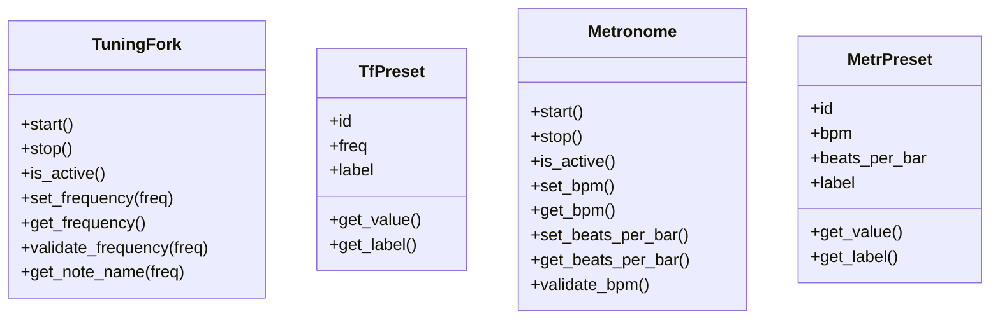
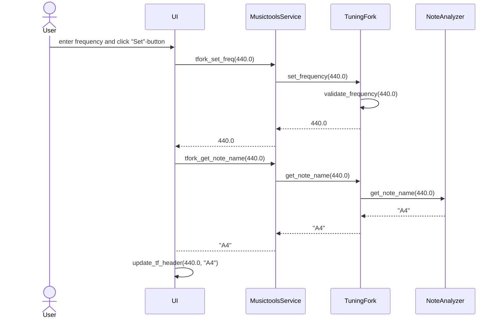
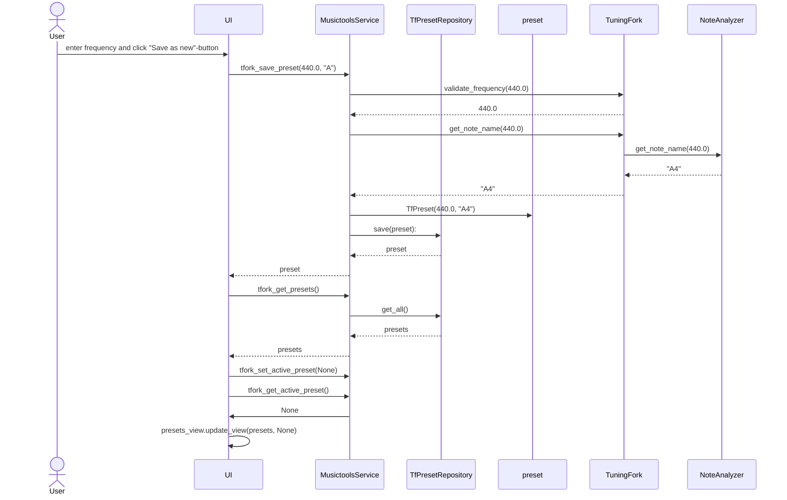

# Arkkitehtuurikuvaus

## Rakenne

Ohjelman rakenne noudattaa kolmitasoista kerrosarkkitehtuuria, jossa pakkaus **ui** sisältää käyttöliittymästä vastaavan koodin, pakkauksessa **services** on sovelluslogiikasta vastaava koodi, ja pakkaus **repositories** sisältää koodin, joka vastaa tietojen pysyväistallennuksesta tietokantaan.  
Pakkauksesta **entities** löytyvät luokat, jotka kuvaavat sovelluksen tietokohteita, eli äänirautaa, metronomia sekä molempien musiikkityökalujen tallennettuja esiasetuksia.

Sovelluksen pakkaus- ja luokkarakenne näyttää seuraavalta:


## Käyttöliittymä

Sovelluksen käynnistyessä luokka [UI](../src/ui/ui.py) avaa rinnakkain samaan ikkunaan äänirauta- ja metronominäkymät, jotka ovat toteutettu omina luokkinaan ([TuningForkView](../src/ui/tuning_fork_view.py) sekä [MetronomeView](../src/ui/metronome_view.py)). Äänirauta- ja metronominäkymät perivät molemmat [ToolView-luokan](../src/ui/tool_view_base.py), joka sisältää yhteisiä toiminnallisuuksia.  

Sekä äänirauta että metronomi hyödyntävät omaa instanssia [PresetsView-luokkasta](../src/ui/presets_view.py) tallennettujen esiasetusten näyttämiseen ja hallinnoimiseen. PresetsView vieritettävissä olevia alueita nappeja varten [ScrollableArea](../src/ui/presets_view.py#L203)-apuluokan avulla.

Sovelluslogiikka on eristetty luokkaan [MusictoolsService](../src/services/musictools_service.py), jonka tarjoamia metodeja käyttöliittymän luokat tarvittaessa kutsuvat. 

Työkalujen yhteydessä näytettävien ikonien kuvatiedostojen nimiä voi halutessaan muokata ympäristömuuttujia sisältävässä [.env-tiedostossa](../.env) musictools-hakemiston juuressa. Itse kuvatiedostot haetaan hakemistosta [_images_](../src/images/).  
.env-tiedostossa on myös muokattavat muuttujat metronomin käyttöliittymässä näkyvän Beats per bar-pudotusvalikon maksimi- ja minimiarvoille.

## Sovelluslogiikka

Sovelluslogiikasta vastaa luokan [MusictoolsService](../src/services/musictools_service.py) ainoa olio, joka tarjoaa ääniraudalle ja metronomille metodit muun muassa arvojen asettamiseen, työkalujen käynnistämiseen ja pysäyttämiseen sekä esiasetusten lukemiseen, tallentamiseen, muokkaamiseen ja poistamiseen.

Esiasetusten käsittelemiseen MusictoolsService käyttää luokkien [TfPresetRepository](../src/repositories/tf_preset_repository.py) ja [MetrPresetRepository](../src/repositories/metr_preset_repository.py) tarjoamia metodeja. Molempien Repository-luokkien totetutus injektoidaan sovelluslogiikkaoliolle parametreina, kun sen konstruktorifunktiota kutsutaan. 


### Tietokohteita kuvaavat luokat

Sovelluksen tietokohteita ovat entities-pakkauksessa sijaitsevat äänirautaa kuvaava luokka [TuningFork](../src/entities/tuning_fork.py), sekä metronomia kuvaava luokka [Metronome](../src/entities/metronome.py).  
Äänirauta- ja metronomiluokkien vastuulla on myös työkaluille syötettyjen arvojen validointi. Validoinnissa hyödynnetään [.env-tiedoston](../.env) kautta muokattavissa olevia maksimi- ja minimiarvoja ääniraudan ja metronomin asetuksille. Samassa tiedostossa voi myös muokata metronomin tikitysääninä käyttämien äänitiedostojen nimiä. Äänitiedostojen on kuitenkin edelleen sijaittava hakemistossa [_sounds_](../src/sounds/).

TuningFork-luokka hyödyntää apuluokkaa [NoteAnalyzer](../src/entities/tuning_fork.py#L145) sävelen nimen laskemisessa annetun taajuuden pohjalta. Myös sävelnimen laskemissa referenssipisteenä käytetyn a-sävelen taajuus on muokattavissa [.env-tiedostossa](../.env), muttujan TF_BASE_A avulla.

Luokat [TfPreset](../src/entities/tf_preset.py) ja [MetrPreset](../src/entities/metr_preset.py) kuvaavat molempien työkalujen tallennettujen esiasetusten sisältöä, sekä tarjovat julkiset metodit esiasetuksen numeraalisen arvon ja nimen lukemiseen.




## Tietojen pysyväistallennus

Pakkauksesta [repositories](../src/repositories) löytyvät luokat [TfPresetRepository](../src/repositories/tf_preset_repository.py) ja [MetrPresetRepository](../src/repositories/metr_preset_repository.py) vastaavat toiminnoista, jotka liittyvät musikaalisten työkalujen esiasetusten tallentamiseen sekä tietokannasta lukemiseen ja poistamiseen. TfPresetRepositoryn vastuulla ovat ääniraudan esiasetukset; MetrPresetRepository käsittelee vastaavasti metronomin tallennettuja esiasetuksia.

Esiasetukset tallennetaan SQLite-tietokantaan: ääniraudan asetukset tauluun _tf_presets_ ja metronomin asetukset tauluun _metr_presets_.  
Tietokanta on alustettava ennen sovelluksen ensimmäistä kännistystä. Tämä tapahtuu [initialize_database.py-tiedoston](../src/initialize_database.py#L51) tarjoaman initialize_database-metodin avulla.

Tietokantatiedosto tallentuu [_data_-hakemistoon](../data/) tiedostonimellä, joka on muokattavissa .env-tiedoston DATABASE_FILENAME-muuttujan avulla.

Koska tallennettujen asetusten käsittely on eristetty omiin luokkiinsa, tietojen tallennustapaa on helppo muuttaa myöhemmin.

## Päätoiminnallisuudet:

Seuraavat sekvenssikaaviot kuvaavat muutamia sovelluksen toiminnallisuuksia.

### Viritysäänen asettaminen:

Käyttäjä kirjoittaa ääniraudan syötekenttään halutun taajuuden ja painaa Set-nappia:



Set-napin [tapahtumakäsittelijä](../src/ui/tuning_fork_view.py#L129) kutsuu sovelluslogiikkaluokan MusictoolsService tarjoamaa [tfork_set_freq-metodia](../src/services/musictools_service.py#L62), parametrina syötetty taajuus. MusictoolsService puolestaan kutsuu äänirautaluokan [set_frequency-metodia](../src/entities/tuning_fork.py#L102), joka tarkistaa, että annettu taajuus on liukuluku sekä minimi- ja maksimiarvojen sisällä.  
Jos syötetty taajuus on oikeanmuotoinen, äänirauta-olion taajuus päivittyy ja sovelluslogiikkaluokalle palautuu hyväksytty taajuus (muutoin palautuu None). Sovelluslogiikka palauttaa hyväksytyn taajuuden UI-näkymälle, joka tämän jälkeen pyytää sovelluslogiikkaluokalta hyväksytyn taajuuden sävelnimeä, MusictoolsService-luokan tarjoaman metodin [tfork_get_note_name](../src/services/musictools_service.py#L127) avulla.
Sovelluslogiikka välittää tajuuden eteenpäin ääniraudan TuningFork-luokalle, joka puolestaan hyödyntää apuluokkaa [NoteAnalyzer](../src/entities/tuning_fork.py#L145) sävelnimen laskemisessa. Äänirauta palauttaa sävelnimen sisältävän merkkijono MusictoolsService-oliolle, joka puolestaan palauttaa sen UI-näkymälle. Tämän jälkeen UI-näkymä päivittää ääniraudan asetukset näyttävän ruudun [update_tf_header-metodin](../src/ui/tuning_fork_view.py#L117) avulla.


### Viritysäänen tallentaminen:

Käyttäjä painaa ääniraudan syötekentän yhteydessä olevaa Save as new-nappia tallentaakseen kenttään kirjoitetun taajuuden uudeksi esiasetukseksi:



Save-napin [tapahtumakäsittelijä](../src/ui/tuning_fork_view.py#L129) kutsuu sovelluslogiikkaluokan MusictoolsService tarjoamaa [tfork_save_preset-metodia](../src/services/musictools_service.py#L97), parametrina kenttään syötetty taajuus.  
Sovelluslogiikka tarkistaa syötteen oikeellisuuden TuningFork-luokan [validate_frequency-metodin](../src/entities/tuning_fork.py#L80) avulla. Äänirautaluokka palauttaa hyväksytyn taajuuden sovelluslogiikkalle, joka tämän jälkeen pyytää TuningFork-luokalta taajuutta vastaavaa sävelnimeä, vastaavalla tavalla kuin viritysäänen asettamista kuvaavassa sekvenssikaaviossa. Tämän jälkeen sovelluslogiikka luo uuden [TfPreset](../src/entities/tf_preset.py)-olion, joka saa parametreikseen taajuuden ja sävelnimen, ja antaa esiasetusolion eteenpäin TfRepository-luokalle, luokan tarjoaman [save-metodin](../src/repositories/tf_preset_repository.py#L45) parametrina.  
TfRepository palauuttaa tallennetun esiasetus-olion sovelluslogiikalle, joka välittää sen eteenpäin UI-näkymälle. UI-näkymä pyytää tämän jälkeen sovelluslogiikalta kaikkia ääniraudan tallennettuja esiasetuksia, MusictoolsService-luokan tarjoaman metodin [tfork_get_presets](../src/services/musictools_service.py#L88) avulla. Sovelluslogiikka [välittää kyselyn eteenpäin](../src/services/musictools_service.py#L95) TfRepository-luokalle, joka [hakee tallennetut esiasetukset tietokannasta](../src/repositories/tf_preset_repository.py#L19) ja palauttaa ne sovelluslogiikalle listana TfPreset-olioita. Sovelluslogiikka palauttaa oliolistan UI-näkymälle, joka tämän jälkeen nollaa sovelluslogiikan muuttujassa tallessa olevan aktiivisen esiasetusnapin arvon kutsumalla metodia [tfork_set_active_preset](../src/services/musictools_service.py#L160) parametrilla None. Lopuksi UI-näkymä päivittää esiasetusnäkymänsä kutsumalla preset-näkymää kuvaavan PresetView-luokan tarjoamaa [update_view-metodia](../src/ui/presets_view.py#L179), joka saa parametreikseen tallennetut esiasetukset ja tällä hetkellä aktiivisena olevan esiasetuksen id-numeron, joka tosin nyt on None.

### Tallennetun viritysäänen päivittäminen:

Kun käyttäjä painaa käyttöliittymässä olevaa ääniraudan esiasetusnappia, napin [tapahtumakäsittelijä](../src/ui/tuning_fork_view.py#L188) tallentaa sovelluslogiikkaolioon tiedon tällä hetkellä aktiivisena olevasta esiasetusnapista MusictoolsService-luokan tarjoaman [tfork_set_active_preset](../src/services/musictools_service.py#L160)-metodin avulla. Samalla käyttöliittymän [Update-nappi aktivoituu](../src/ui/tuning_fork_view.py#L199). Esiasetusnappi saa myös aktiivisuutta kuvaavan kehyksen.   
Kun käyttäjä tämän jälkeen tekee ääniraudan asetuksiin muutoksia, hän voi entiseen tapaan tallentaa muutokset uutena esiasetuksena valitsemalla Save as new. Jos käyttäjä sen sijaan painaa nappia Update, kännistyy seuraava tapahtumasarja:

```mermaid
sequenceDiagram
    actor User
    participant UI
    participant MusictoolsService
    User->>UI: click "Update"-button
    UI->>MusictoolsService: tfork_get_active_preset
    MusictoolsService-->>UI: 2
    UI->>MusictoolsService: tfork_update_preset(523.25, 2)
    MusictoolsService->>TuningFork: validate_frequency(523.25)
    TuningFork-->>MusictoolsService: 523.25
    MusictoolsService->>TuningFork: get_note_name(523.25)
    TuningFork->>NoteAnalyzer: get_note_name(523.25)
    NoteAnalyzer-->>TuningFork: "C5"
    TuningFork-->>MusictoolsService: "C5"
    MusictoolsService->>preset: TfPreset(523.25, "C5", 2)
    MusictoolsService->>TfPresetRepository: update(preset):
    TfPresetRepository-->>MusictoolsService: preset
    MusictoolsService -->>UI: preset
    UI->>MusictoolsService: tfork_get_presets()
    MusictoolsService->>TfPresetRepository: get_all()
    TfPresetRepository-->>MusictoolsService: presets
    MusictoolsService-->>UI: presets
    UI->>MusictoolsService: tfork_get_active_preset()
    MusictoolsService-->>UI: 2
    UI->>UI: presets_view.update_view(presets, 2)
 ```

Update-napin [tapahtumakäsittelijä](../src/ui/tuning_fork_view.py#L167) kutsuu sovelluslogiikkaluokan MusictoolsService tarjoamaa [tfork_update_preset-metodia](../src/services/musictools_service.py#L129), parametrina kenttään syötetty taajuus.  
Taajuuden oikeellisuuden tarkistaminen ja taajutta vastaavan sävelnimen luominen tapahtuu vastaavasti kuin yllä olevissa viritysäänen asettamista ja tallentamista kuvaavissa sekvenssikaaviossa.  
Sovelluslogiikka luo tämän jälkeen [uuden TfPreset-olion](../src/services/musictools_service.py#L144), joka saa parametreikseen päivitetyn taajuuden ja sävelnimen, mutta saman id-numeron kuin päivitettävällä esiasetuksella. Sovelluslogiikka kutsuu TfRepository-luokan tarjoamaa metodia [update](../src/repositories/tf_preset_repository.py#L65) ja antaa sille parametriksi päivitetyn TfPreset-olion. TfRepository-luokka päivittää tietokannasta vastaavalla id-numerolla löytyvän esiasetuksen, ja palauttaa päivitetyn TfPreset-olion MusictoolsService-oliolle, joka puolestaan palauttaa sen UI-näkymälle.
Tämän jälkeen tapahtuva UI-näkymän päivitys tapahtuu vastaavalla tavalla kuin esiasetuksen tallennuksen yhteydessä, sillä erotuksella, että aktiivisena olevan esiasetusnapin arvoa ei tällä kertaa nollata. Preset-näkymää kuvaavan PresetView-luokan [update_view-metodi](../src/ui/presets_view.py#L179) saakin nyt parametrikseen juuri muokatun esiasetuksen id-numeron.


### Tallennetun viritysäänen poistaminen:

Jos käyttäjä haluaa poistaa ääniraudalle tallennetun esiasetuksen, hän avaa ensin esiasetusten hallinointinäkymän painamalla nappia Manage. Tämän jälkeen käyttäjä painaa poistettavan esiasetuksen vieressä olevaa Delete-nappia:

```mermaid
sequenceDiagram
    actor User
    participant UI
    participant MusictoolsService
    participant TfPresetRepository
    User->>UI: click "Delete"-button
    UI->>MusictoolsService: tfork_delete_preset("2")
    MusictoolsService->>TfPresetRepository: delete("2")
    UI->>MusictoolsService: tfork_get_presets()
    MusictoolsService->>TfPresetRepository: get_all()
    TfPresetRepository-->>MusictoolsService: presets
    MusictoolsService-->>UI: presets
    UI->>UI: presets_view.update_view(presets)
```

Tapahtumasarja käynnistyy UI-näkymän [Delete-napin tapahtumakäsittelijästä](../src/ui/tuning_fork_view.py#L157), joka kutsuu sovelluslogiikan metodia [tfork_delete_preset](../src/services/musictools_service.py#L118), parametrina poistettavan esiasetuksen id merkkijonoesityksenä.  
Sovelluslogiikka kutsuu puolestaan TfPresetRepository-luokan metodia [delete](../src/repositories/tf_preset_repository.py#L66), joka poistaa kyseisen id-numeron omaavan esiasetuksen tietokannasta.  
Tämän jälkeen UI-näkymä pyytää sovelluslogiikalta kaikkia tallennettuja ääniraudan esiasetuksia, vastaavalla tavalla kuin yllä kuvatun viritysäänen tallennuksen yhteydessä. Kun lista TfPreset-olioita palauutuu UI-näkymälle, se päivittää esiasetusnäkymänsä, jolloin poistettu esiasetus häviää näkymästä.

### Metronomi ja muut toiminnot

Metronomiin liittyvät toiminnallisuudet toimivat vastaavalla tavalla kuin yllä esitellyt äänirautaan liittyvät toiminnot: käyttöliittymän tapahtumakäsittelijä kutsuu MusictoolsServices-sovelluslogiikkaluokan metodeja, ja sovelluslogiikka välittää pyynnöt eteenpäin metronomi-oliolle tai pysyväistallennuksesta vastaavalle MetrPresetRepository-luokan oliolle. Tämän jälkeen sovelluslogiikka palauttaa mahdollisen vastauksen käyttöliittymälle, joka päivittää tarvittaessa näkymänsä. Sama logiikka pätee myös ääniraudan muille toiminnallisuuksille.
