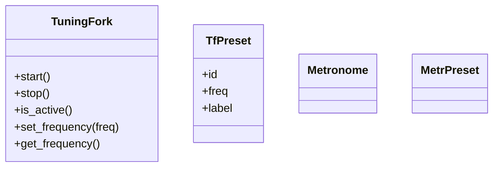
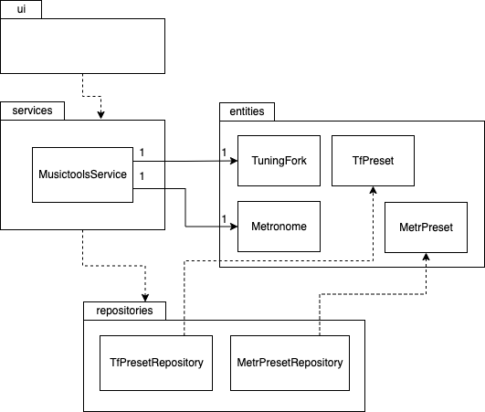

# Arkkitehtuurikuvaus

## Sovelluslogiikka

### Keskeiset luokat:

```mermaid
classDiagram
    class TuningFork{   
        +start()
        +stop()
        +is_active()
        +set_frequency(freq)
        +get_frequency()
    }
    
    class TfPreset{
        +id
        +freq
        +label
    }
    class Metronome{
    }
    class MetrPreset{
    }    
```
### Pakkaus- ja luokkkaavio:

