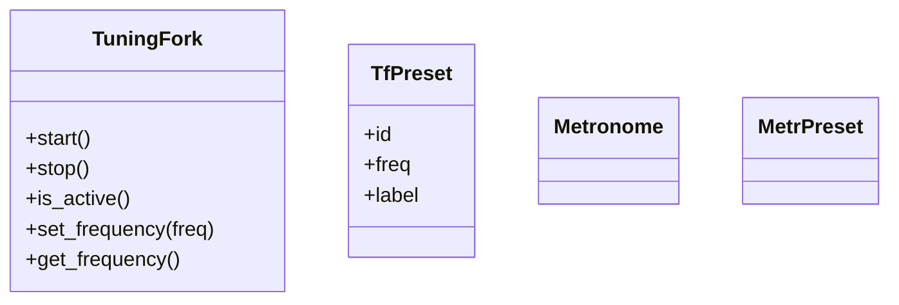
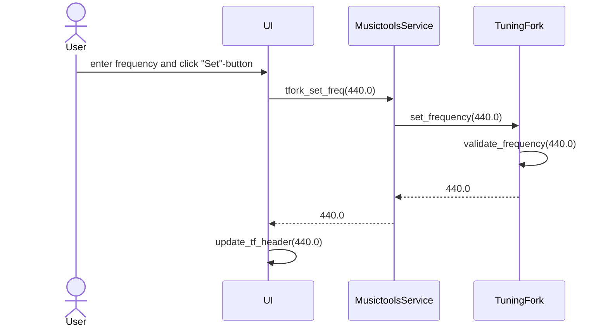
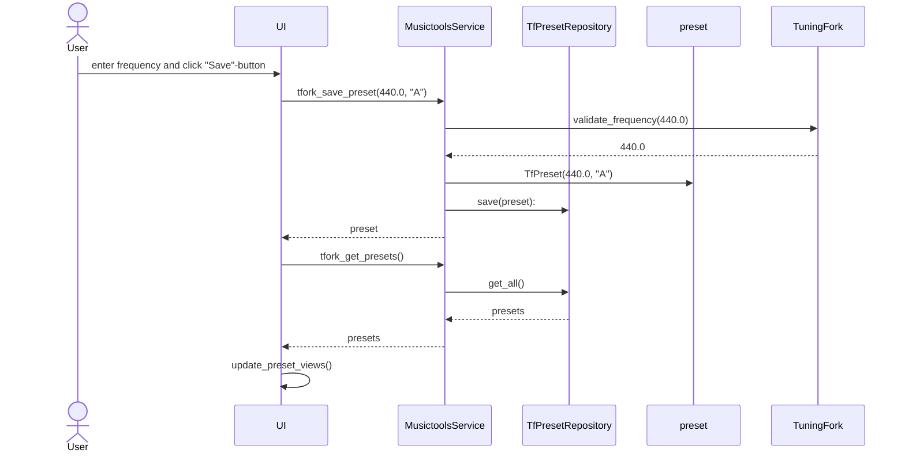

# Arkkitehtuurikuvaus

## Sovelluslogiikka

### Keskeiset luokat:

```mermaid
classDiagram
    class TuningFork{   
        +start()
        +stop()
        +is_active()
        +set_frequency(freq)
        +get_frequency()
    }
    
    class TfPreset{
        +id
        +freq
        +label
    }
    class Metronome{
    }
    class MetrPreset{
    }    
```
### Pakkaus- ja luokkkaavio:

## Päätoiminnallisuudet:

### Viritysäänen asettaminen:

```mermaid
sequenceDiagram
    actor User
    participant UI
    participant MusictoolsService
    User->>UI: enter frequency and click "Set"-button
    UI->>MusictoolsService: tfork_set_freq(440.0)
    MusictoolsService->>TuningFork: set_frequency(440.0)
    TuningFork->>TuningFork: validate_frequency(440.0)
    TuningFork-->>MusictoolsService: 440.0
    MusictoolsService-->>UI: 440.0
    UI->>UI: update_tf_header(440.0) 
```

### Viritysäänen tallentaminen:

```mermaid
sequenceDiagram
    actor User
    participant UI
    participant MusictoolsService
    participant TfPresetRepository
    participant preset
    participant TuningFork
    User->>UI: enter frequency and click "Save"-button
    UI->>MusictoolsService: tfork_save_preset(440.0, "A")
    MusictoolsService->>TuningFork: validate_frequency(440.0)
    TuningFork-->>MusictoolsService: 440.0
    MusictoolsService->>preset: TfPreset(440.0, "A")
    MusictoolsService->>TfPresetRepository: save(preset):
    MusictoolsService -->>UI: preset
    UI->>MusictoolsService: tfork_get_presets()
    MusictoolsService->>TfPresetRepository: get_all()
    TfPresetRepository-->>MusictoolsService: presets
    MusictoolsService-->>UI: presets
    UI->>UI: update_preset_views()
```
