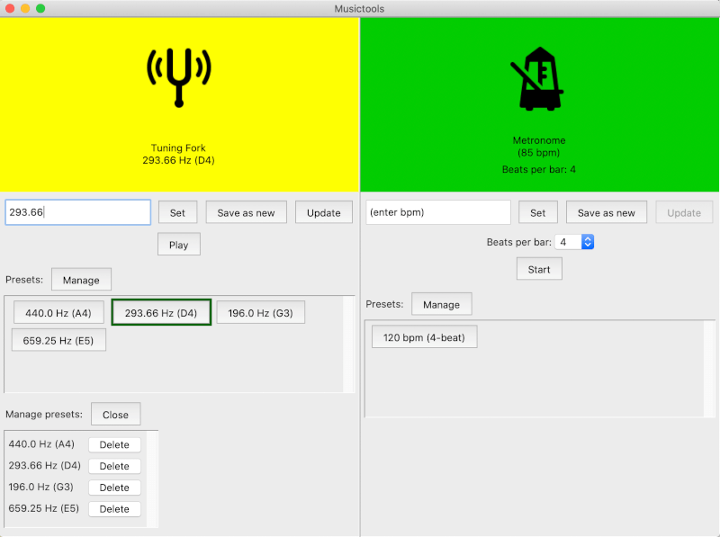

# Käyttöohje

Projektin viimeisin release löytyy sivulta [Releases](https://github.com/piamanns/ot-harjoitustyo/releases).
Lataa releasen lähdekoodi klikkamalla jompaakumpaa _Source code_-linkkiä _Assets_-otsikon alla.

## Konfigurointi

Sovelluksessa on useampia konfiguroitavia muuttujia, joita voi halutessaan muokata musictools-hakemiston juuressa sijaitsevassa _.env_-tiedostossa.

Muuttuja **DATABASE_FILENAME** määrittelee tiedostonimen SQLite-tietokannalle, joka tallentuu _data_-hakemistoon.
```
DATABASE_FILENAME="database.sqlite"
```
Muuttujiin **METR_CLICK_FILENAME** ja **METR_CLICK_UP_FILENAME** on tallennettu metronomin klikkiäänien tiedostonimet. Äänet haetaan _sounds_-hakemistosta.
```
METR_CLICK_FILENAME="click.wav"
METR_CLICK_UP_FILENAME="click_up.wav"
```
**TF_ICON_FILENAME** ja **METR_ICON_FILENAME** viittaavat ääniraudan ja metronomin ikonien kuvatiedostoihin _images_-hakemistossa.
```
TF_ICON_FILENAME="icons8-tuning-fork-96.png"
METR_ICON_FILENAME="icons8-metronome-96.png"
```
**TF_BASE**-muuttujan avulla voi muokata a-sävelen frekvenssiä, jota sovellus käyttää referenssiarvona, kun se laskee eri taajuuksille sävelnimiä. 
```
TF_BASE_A=440
```
**TF_FREQ_MAX** ja **TF_FREQ_MIN**-muuttujiin voi syöttää ääniraudan maksimi- ja minimitaajuudet.
```
TF_FREQ_MAX=8000
TF_FREQ_MIN=16
```
Muuttujien **METR_BPM_MAX** ja **METR_BPM_MIN** avulla voi muokata metronomin bpm-arvon ylä- ja alarajaa.
```
METR_BPM_MAX=500
METR_BPM_MIN=1
```
Muuttujat **METR_BEATS_MAX** ja **METR_BEATS_MIN** määrittävät maksimi- ja minimiarvon valittavissa oleville iskujen määrälle per tahti metronominäkymässä.
```
METR_BEATS_MAX=12
METR_BEATS_MIN=1
```

## Ohjelman käynnistäminen

Siirry kansioon musictools ja asenna ohjelman rippuvuudet komennolla:

```bash
poetry install
```

Sovelluksen käyttämä tietokanta on alustettava ennen ensimmäistä käynnistystä.
Alusta tietokanta komennolla:

```bash
poetry run invoke init-database
```

Tämän jälkeen sovelluksen voi käynnistää komennolla:

```bash
poetry run invoke start
```

## Ohjelman käyttö

Sovellus käynnistyy näkymään, jossa on rinnakkain kaksi musiikkiin liittyvää työkalua, **äänirauta** ja **metronomi**.


### Äänirauta ja esiasetusten hallinnointi

Ääniraudalle voi asettaa viritysäänen korkeuden kirjoittamalla haluttu taajuus _(enter frequency)_-kenttään ja painamalla nappia _Set_.
Taajuuden voi myös asettaa esiasetusnappia painamalla, jos esiasetuksia on tallennettu.

Viritysääni käynnistyy painamalla nappia _Play_ ja pysähtyy painamalla samaa nappia uudestaan.

Taajuuskentässä näkyvän arvon voi tallentaa uudeksi esiasetukseksi _Save as new_-nappia painamalla. Sovellus generoi automaattisesti taajuudelle sävelnimen, joka tallentuu esiasetuksen nimeksi. Nimi lasketaan tasavireisen asteikon mukaan, ympäristömuuttujana asetettavissa olevan a-sävelen pohjalta.

Tallennetun esiasetuksen arvoja voi muuttaa painamalla kyseistä esiasetusnappia. Tämän jälkeen työkalun arvoihin tehdyt muutokset voi tallentaa samaan esiasetukseen painamalla nappia _Update_. Esiasetus, johon Update-napin päivitystoiminto kohdistuu, on merkitty vihreällä kehyksellä.



Tallennettuja esiasetuksia voi poistaa painamalla _Manage_-nappia. Tällöin avautuu uusi näkymä, jossa tallennetut esiasetukset ovat listattu. Esiasetuksen voi poistaa painamalla esiasetuksen nimen vieressä olevaa _Delete_-nappia.

Esiasetusten hallinointinäkymä suljetaan painamalla nappia _Close_.


### Metronomi

Metronomille voi asettaa bpm-arvon (eli iskujen määrän minuutissa) kirjoittamalla kokonaisluvun kenttään _(enter bpm)_ ja painamalla nappia _Set_.

_Beats per bar_-pudotusvalikosta voi valita iskujen määrän tahdissa, jolloin metronomi painottaa tahtien ensimmäiset iskut erilaisella klikkiäänellä. Jos pudotusvalikossa on valittuna arvo 1, painotusta ei tehdä. 

Metronomi käynnistyy _Start_-nappia painamalla ja pysähtyy, kun samaa nappia painaa uudestaan.
 
Metronomin esiasetusten tallentaminen, muokkaaminen ja poistaminen toimii vastavalla tavalla kun äänirautanäkymässä. Metronomin esiasetuksiin tallentuu sekä bpm-arvo että valittuna oleva beats per bar-arvo.
