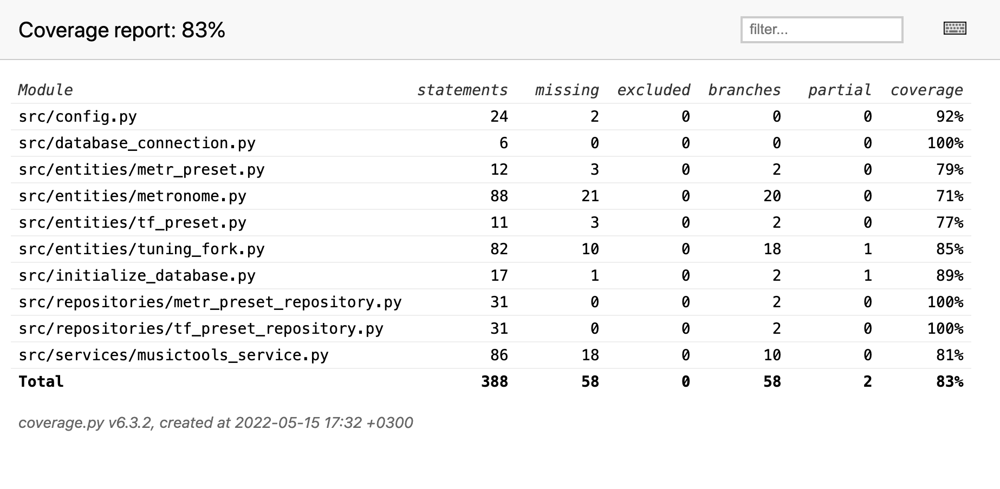

# Testausdokumentti

Ohjelmaa on testattu automatisoiduilla yksikkö- ja integraatiotesteillä unittest-sovelluskehyksen avulla. Järjestelmätason testaus on tehty manuaalisesti.

## Yksikkö- ja integraatiotestaus

## Tietokohteet

Äänirauta- ja Metronomi-työkaluja testataan [TestTuningFork](../src/tests/tuning_fork_test.py)- ja [TestMetronome](../src/tests/metronome_test.py)-testiluokilla.

### Sovelluslogiikka

Sovelluslogiikasta vastaavaa MusictoolsService-luokkaa testataan testiluokalla [TestMusictoolsService](../src/tests/musictools_service_test.py).  
Testauksen yhteydessä MusictoolsService-olio käyttää repositorioina luokista FakeTfPresetRepository ja FakeMetrPresetRepository luotuja olioita, jotka pysyväistallennuksen sijasta tallentavat työkalujen esiasetuksia muistiin.

### Repositiorioluokat

Repositorioluokkien TfPresetRepository ja MetrPresetRepository testeissä käytetään erillistä testitietokantaa, jonka tiedostonimi on konfiguroitavissa .env.test-tiedostossa.   
TfPresetRepository-luokkaa testataan [TestTfPresetRepository](../src/tests/tf_preset_repository_test.py)-testiluokalla ja MetrPresetRepository-luokkaa vastaavasti [MetrPresetRepository](../src/tests/metr_preset_repository_test.py)-testiluokalla.

### Testauskattavuus

Sovelluksen testauksen haarautumakattavuus on 83%. Käyttöliittymäkerros on jätetty testauksen ulkopuolelle.

Ääniraudassa ja metronomissa testaamatta jäivät muun muassa ulkopuolisen sounddevice-moduuliin liittyviä toimintoja.  
MusictoolsService-sovelluslogiikkaluokan haarautumakattavuutta laskee osittain se, että metodit, jotka pelkästään välittävät eteenpäin ääniraudan ja metronomin palauttamia arvoja, joiden oikeellisuutta testataan jo työkalujen omissa testeissä, on jätettty sovelluslogiikkaluokan testeistä pois.

## Järjestelmätestaus

Sovelluksen järjestelmätestaus on tehty manuaalisesti.

### Sovelluksen asennus ja konfigurointi

Sovellus on ladattu, asennettu ja käynnistetty [käyttöohjeen](./kayttoohje.md) mukaisesti macOS- ja Linux-ympäristöissä. Testeissä on käytetty erilaisia .env-tiedoston ympäristömuuttujien asetuksia sekä kokeiltu sovelluksen käyttöä  tilanteissa, joissa tietokanta on tyhjä, ja tilanteissa, joissa tallennettuja esiasetuksia on jo olemassa. 

### Toiminnallisuudet

Kaikki [määrittelydokumentissa](./vaatimusmaarittely.md) ja [käyttöohjeissa](./kayttoohje.md) mainitut toiminnallisuudet on testattu manuaalisesti. Syötteiden antamisen yhteydessä on myös tarkistettu sovelluksen toimivuus virheellisillä syötteillä, kuten vääräntyyppisillä syötteillä tai liian pienillä tai isoilla arvoilla.

### Sovellukseen jääneet laatuongelmat

- Sovellus ei tällä hetkellä tarkista käyttäjän .env-tiedostossa asettamien ympäristömuuttujien arvojen järkevyyttä mitenkään.
- Sovellus ei käynnisty ollenkaan, jos tietokannan alustaminen ennen ensimmäistä käynnistystä on unohtunut.
- Pylint ilmoittaa, että MusictoolsService-luokalla on liian monta julkista metodia. Koska ääniraudalla ja metronomilla on osittain samoja toimintoja, MusictoolsService-luokkaa voisi tiivistää refaktoroimalla.
- Myös metronomi-luokalla on liian monta instanssiattribuuttia.
