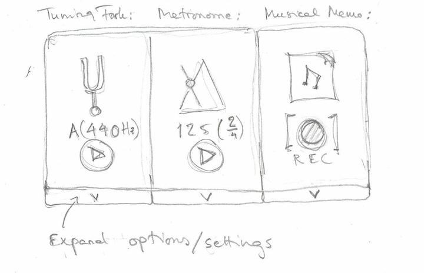

# Vaatimusmäärittely

## Sovelluksen tarkoitus

Sovellus sisältää muutamia musiikin harrastajalle tarpeellisia työkaluja: ääniraudan, metronomin, ja ajan salliessa, mahdollisuuden pienten musikaalisten muistiinpanojen tallentamiseen.

## Käyttöliittymäluonnos

Sovellus avautuu näkymään, jossa jokaisen työkalun perustoiminnallisuudet ovat helposti saatavilla.
Jokaisen työkalun asetuksia voi säätää tarkemmin laajentamalla perustoiminnallisuusnäkymää.
Jos sovellusta on käytetty aikaisemmin, sovellus avautuu siihen tilaan, johon työkalut jäivät edellisen käyttökerran jälkeen.

## Perusversion toiminnallisuus

### Elektroninen äänirauta

- Käyttäjä voi valita viritysäänen **(tehty)**
- Käyttäjä voi käynnistää ja pysäyttää viritysäänen **(tehty)**
- Käyttäjä voi nimetä, tallentaa ja ladata ääniraudan asetukset. Käyttäjä voi myös poistaa aiemmin tallennettuja ääniraudan asetuksia. **(osittain tehty, tallennus, lataaminen ja poisto onnistuvat. Tallennettavan asetuksen nimeäminen on vielä työn alla.)**

### Metronomi

- Käyttäjä voi asettaa tempon (bpm) **(tehty)**
- Käyttäjä voi valita tahtilajin. Metronomi painottaa tahtien ykkösiskuja tahtilajin mukaisesti. **(osittain tehty, käyttäjä voi asettaa iskujen määrän tahdissa, jolloin metronomi painottaa ykkösiskuja)**
- Käyttäjä voi käynnistää ja pysäyttää metronomin **(tehty)**
- Käyttäjä voi nimetä, tallentaa ja ladata metronomin asetukset. Käyttäjä voi myös poistaa aiemmin tallennettuja metronomin asetuksia. **(osittain tehty, tallennus, lataaminen ja poisto onnistuvat. Tallennettavan asetuksen nimeäminen on vielä työn alla.)**

## Jatkokehitysideoita

Ajan salliessa perusversiota voidaan laajentaa esimerkiksi seuraavilla toiminnallisuuksilla:

### Elektroninen äänirauta

- Käyttäjä voi asettaa viritysäänen soimisajan
- Käyttäjä voi muokata ääniraudan ääntä mieleisekseen
- Käyttäjä voi yhden ääniraudan sijaan valita käytettäväksi äänirautojen kokoelman, esimerkiksi kitaran kaikkien kielien virittämistä varten

### Metronomi

- Metronomi laskee bpm-arvon tahdin naputuksen perusteella
- Metronomin visualisonti, joka auttaa hahmottamaan tahtia myös silloin, kun metronomia ei oman soiton takia kuule
- Käyttäjä voi valita, kuinka monta tahtia metronomi tikittää
- Käyttäjä voi asettaa metronomille halutun pituisen intron, joka eroaa äänensävyltään varsinaisesta metronomiäänestä
- Käyttäjä voi muokata metronomin ääntä mieleisekseen

### Musikaalinen muistiinpano

- Käyttäjä voi helposti nauhoittaa ja tallentaa lyhyen musikaalisen idean 
